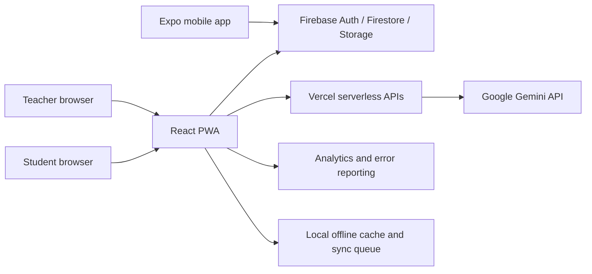
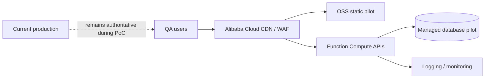

# Avantura MKD Pro — Technical Documentation

**Version:** 0.1 working draft  
**Purpose:** Technical due diligence, donor review and cloud migration planning

## 1. Product scope

Avantura MKD Pro is a TypeScript-based EdTech SaaS platform with:

- a React 19/Vite progressive web application;
- an Expo/React Native mobile application;
- shared TypeScript domain models;
- authenticated teacher, administrator and public/student flows;
- adventure authoring, live sessions, offline play, analytics and AI-assisted generation.

## 2. Current architecture

> **Illustration TD-01:** Rendered and branded version of the current architecture.

## 3. Repository structure

| Path | Responsibility |
|---|---|
| `apps/web` | React PWA, teacher dashboard and browser player |
| `apps/mobile` | Expo mobile player |
| `packages/shared` | Shared types, limits, validation and domain utilities |
| `api` | Server-side API endpoints |
| `e2e` | Playwright QA harness and browser tests |
| `firestore.rules` / `storage.rules` | Firebase authorisation controls |

## 4. Core functional modules

- Authentication: Google OAuth and email/password.
- Adventure authoring: settings, stages, maps, media and learning objectives.
- Gameplay: browser/mobile execution, QR, GPS, missions, quizzes and branching.
- Live sessions: join codes, teacher controls, monitoring and results.
- Analytics: leaderboard, funnel, weak spots, grading and exports.
- Offline operation: local quest cache, queued submissions and reconnect sync.
- AI assistance: server-side Gemini requests; API keys are not exposed to clients.
- Payments: current repository contains bank-transfer/PayPal workflows and Stripe server endpoints; production availability must be documented per market.

## 5. Data model overview

Principal entities include users/profiles, adventures, stages, results, groups, templates, payment requests and live sessions. Shared TypeScript types and validation schemas define cross-client contracts.

As of 23 July 2026, stable per-student result identity, idempotent/immutable attempts with a selectable resolution policy (first/latest/best/teacher-approved), and a curriculum objective-mapping + coverage + per-student mastery model are all implemented and covered by dedicated tests — this was previously listed as future work and has since been delivered. A student/parent-facing (as opposed to teacher-facing) mastery report remains outstanding; the teacher-facing CSV export is live in class management.

## 6. Security and privacy controls

Current controls include:

- Firebase authentication and owner-based Firestore rules, with a documented internal audit confirming every new field added by the student-identity/attempt/objective work rides on already owner-gated documents;
- stable per-student result identity and owner-only, field-scoped attempt-approval rules (an approval update may only touch `approvedAt`/`approvedBy`, bound to the authenticated UID);
- administrator custom claims;
- server-side AI secret handling;
- request validation and sanitisation;
- HTTPS transport through managed platforms;
- restricted payment moderation workflows;
- privacy and terms routes;
- separation of production configuration from QA authentication fixtures.

Required pre-scale work:

- independent (third-party) rules and API penetration review — the current review is internal;
- formal data-retention and deletion schedules;
- documented sub-processors and data regions;
- tested backup/restore and incident response;
- periodic dependency and secret scanning.

## 7. Reliability and offline behaviour

The PWA can cache selected adventures and queue results while offline. Synchronisation uses an in-flight deduplication guard to reduce duplicate submission risk. Offline storage is device-local and must not be treated as a durable institutional backup.

## 8. Quality assurance

Verified locally on 23 July 2026:

- TypeScript typecheck passes;
- 78 Vitest files pass;
- 656 automated tests pass;
- production Vite build passes;
- Playwright provides public and authenticated desktop/mobile coverage, including a dedicated QA-only authenticated harness (mocked auth/storage, no production auth bypass) used to visually verify every UI change.

These numbers are a dated development baseline, not a service-level guarantee. A documented hardening execution ledger records every batch (scope, commit, test count, browser QA evidence) behind this baseline.

## 9. Deployment

Current delivery:

- web application and serverless endpoints: Vercel;
- authentication, database and media: Firebase;
- mobile builds: Expo Application Services;
- source control and CI: GitHub/GitHub Actions.

Environment secrets must be supplied through the hosting platform and never committed to the repository.

## 10. Proposed Alibaba Cloud pilot

The recommended approach is a staged proof of concept, not an immediate production cut-over.

Pilot objectives:

1. validate hosting, latency and operating cost for Balkan/EU users;
2. test static delivery and selected stateless APIs;
3. establish monitoring, budgets and security controls;
4. compare migration complexity against current managed services;
5. produce a go/no-go decision with rollback evidence.

No student production data should enter the pilot until data-processing terms, region, retention, access controls and school consent requirements are approved.

## 11. Observability and operations

Required operational baseline:

- availability and latency dashboards;
- API error-rate and quota alerts;
- storage, database and AI cost budgets;
- audit logging for administrative/payment actions;
- documented severity levels and escalation;
- tested backup, restore and disaster recovery;
- monthly access and dependency review.

## 12. Known roadmap boundaries

Delivered since the previous draft of this document: Card/design-system migration, translation parity and changelog, stable student identity and immutable attempts, and the curriculum objective-mapping/coverage/mastery model with a teacher-facing CSV export.

The following remain planned:

- student/parent-facing (not just teacher-facing) objective-mastery report;
- complete recurring billing lifecycle (trial, renewal, cancellation, dunning);
- onboarding email sequence and institutional renewal/admin documentation;
- institutional operational-readiness audit (monitoring, alerting, backup/restore, incident runbooks).

## 13. Technical due-diligence attachments

Before submission, attach:

- final architecture and data-flow diagrams;
- current test/build evidence;
- security-rule review summary;
- data-protection and retention matrix;
- 12-month cloud consumption estimate;
- migration and rollback plan.
